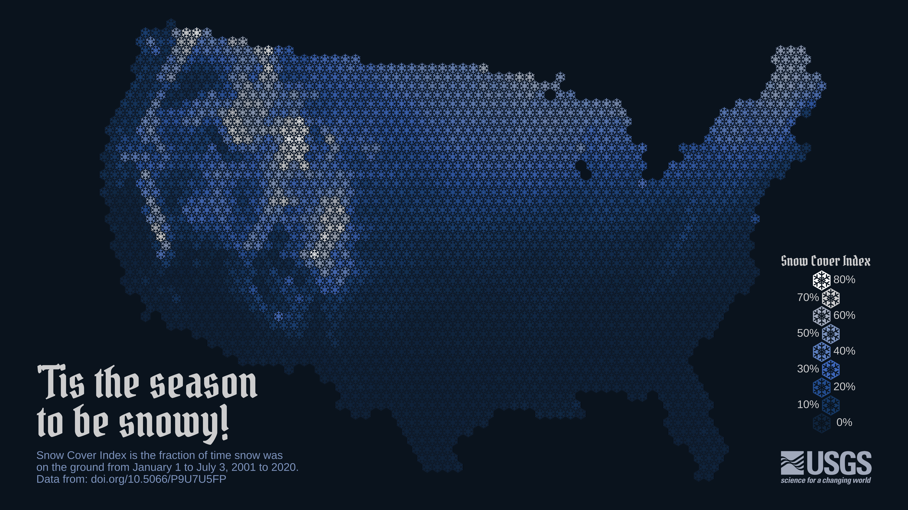

# 432 Class 02: 2024-01-18

[Main Website](https://thomaselove.github.io/432-2024/) | [Calendar](https://thomaselove.github.io/432-2024/calendar.html) | [Syllabus](https://thomaselove.github.io/432-syllabus-2024/) | [Notes](https://thomaselove.github.io/432-notes/) | [Contact Us](https://thomaselove.github.io/432-2024/contact.html) | [Canvas](https://canvas.case.edu) | [Data and Code](https://github.com/THOMASELOVE/432-data) | [Sources](https://github.com/THOMASELOVE/432-classes-2024/tree/main/sources)
:-----------: | :--------------: | :----------: | :---------: | :-------------: | :-----------: | :------------: |:------:
for everything | for deadlines | expectations | from Dr. Love | ways to get help | lab submission | for downloads | to read

## Today's Slides

Class | Date | HTML | Quarto .qmd | Recording
:---: | :--------: | :------: | :------: | :-------------:
02 | 2024-01-18 | **[Slides 02](https://thomaselove.github.io/432-slides-2024/slides02.html)** | **[Code 02](https://github.com/THOMASELOVE/432-slides-2024/blob/main/slides02.qmd)** | Visit [Canvas](https://canvas.case.edu/), select **Zoom** and **Cloud Recordings**

- The HTML link provides the (RevealJS) version of the slides that I suggest you focus on during class.
- The Quarto file link provides the code I used (in [Quarto](https://quarto.org/)) to build the slides.
- To print RevealJS slides **to pdf**, [follow these instructions](https://quarto.org/docs/presentations/revealjs/presenting.html#print-to-pdf) using Google Chrome as your browser.
- We attempt to record every 432 class via Zoom and post the recording to Canvas.

 from <https://xkcd.com/2726>

## Announcements
 
1. **TA Office Hours** begin tomorrow. A complete schedule, with Zoom links, is available on our Shared Google Drive. 
2. Thanks to all of you who completed the [Welcome to 432 Survey](https://bit.ly/432-2024-welcome-survey) on time.
3. [Campuswire](https://campuswire.com/) Poll: About how many times have you opened RStudio in 2024?

Votes | Not at all (that's OK) | 1 to 3 times | More than 3 times
---: | -----: | -----: | -----: 
n = 21 | 10% | 48% | 43%

As of 2023-01-17 at 11:05 AM

## What Should I Be Working On?

- [Lab 1](https://thomaselove.github.io/432-2023/lab1.html), due Tuesday 2024-01-23 at Noon to [Canvas](https://canvas.case.edu/).
- Reading Jeff Leek's *How to be a Modern Scientist* [available from Leanpub](https://leanpub.com/modernscientist). (Complete by January 31.)
- Familiarize yourself with the other Course Materials on the [Website](https://thomaselove.github.io/432-2023/).

## One Last Thing

[Origin and development of a Snowflake Map](https://waterdata.usgs.gov/blog/snow-tiles-demo/) by Althea Archer (posted 2023-01-11) provides reproducible R code demonstrating the evolution of a recent data visualization of snow cover in the continental United States. This work is a product of the USGS (United States Geological Survey) - the nation's largest water, earth and biological science and civilian mapping agency.

I learned about this work from [this post at FlowingData](https://flowingdata.com/2023/01/17/snow-cover-mapped-using-snowflakes/).

## Shameless Promotion

I'm playing Christopher Belling in the musical [Curtains, at Hudson Players](https://www.hudsonplayers.com/now-playing) which runs February 2, 3, 9, 10, 11, 16, 17, 18, 23, 24, 2024 at 8 PM Fridays and Saturdays and 2 PM for the two Sunday shows. Please come if you're interested. Tickets [are available here](https://app.arts-people.com/index.php?ticketing=hudpl). Remember, though, attending or not attending a show I'm in is 100% up to you, and carries no weight with me professionally. Thanks, and I hope to see you there!
