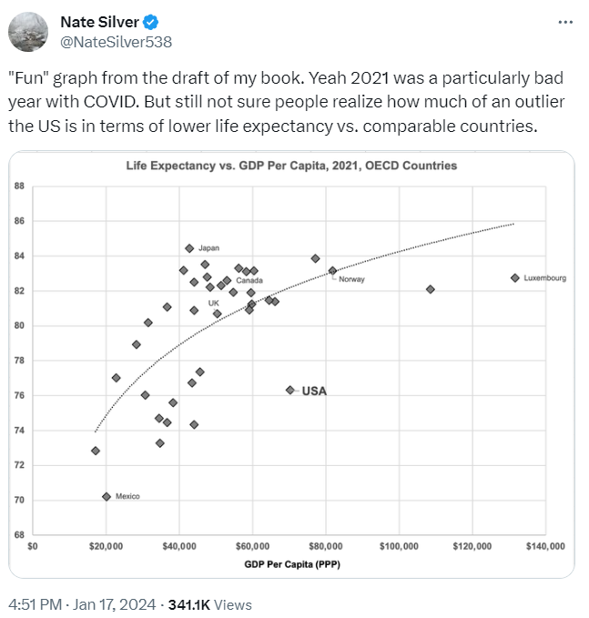

# 432 Class 03: 2024-01-23

[Main Website](https://thomaselove.github.io/432-2024/) | [Calendar](https://thomaselove.github.io/432-2024/calendar.html) | [Syllabus](https://thomaselove.github.io/432-syllabus-2024/) | [Notes](https://thomaselove.github.io/432-notes/) | [Contact Us](https://thomaselove.github.io/432-2024/contact.html) | [Canvas](https://canvas.case.edu) | [Data and Code](https://github.com/THOMASELOVE/432-data) | [Sources](https://github.com/THOMASELOVE/432-classes-2024/tree/main/sources)
:-----------: | :--------------: | :----------: | :---------: | :-------------: | :-----------: | :------------: |:------:
for everything | for deadlines | expectations | from Dr. Love | ways to get help | lab submission | for downloads | to read

## Today's Slides

Class | Date | PDF | Quarto .qmd | Recording
:---: | :--------: | :------: | :------: | :-------------:
03 | 2024-01-23 | **[Slides 03](https://thomaselove.github.io/432-slides-2024/slides03.html)** | **[Code 03](https://github.com/THOMASELOVE/432-slides-2024/blob/main/slides03.qmd)** | Visit [Canvas](https://canvas.case.edu/), select **Zoom** and **Cloud Recordings**

- The HTML link provides the (RevealJS) version of the slides that I suggest you focus on during class.
- The Quarto file link provides the code I used (in [Quarto](https://quarto.org/)) to build the slides.
- To print RevealJS slides **to pdf**, [follow these instructions](https://quarto.org/docs/presentations/revealjs/presenting.html#print-to-pdf) using Google Chrome as your browser.
- We attempt to record every 432 class via Zoom and post the recording to Canvas.

## More to come.

## On Using AI in Labs

If you decide to use some sort of AI to help you with a Lab, we ask that you place a note to that effect, as a separate section, just before your presentation of Session Information. Thank you.

## One Last Thing

## Self-Promotion

Tickets to [Curtains, the musical](https://www.hudsonplayers.com/now-playing), in which I play Christopher Belling, are going very quickly. If you'd like to go, please visit <https://www.hudsonplayers.com/>. The show runs February 2-24 on the weekends. It would give me great joy to see you there!
