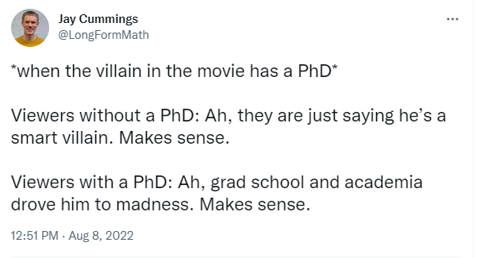
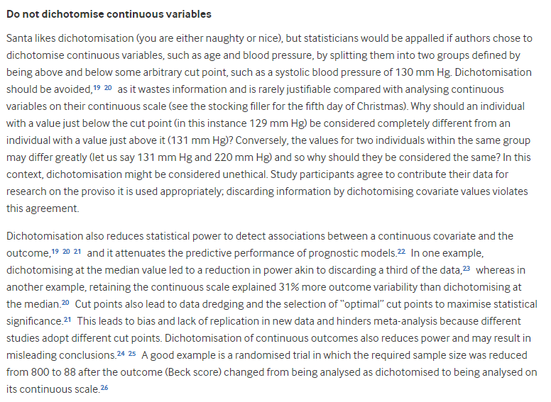

# 432 Class 04: 2024-01-25

[Main Website](https://thomaselove.github.io/432-2024/) | [Calendar](https://thomaselove.github.io/432-2024/calendar.html) | [Syllabus](https://thomaselove.github.io/432-syllabus-2024/) | [Notes](https://thomaselove.github.io/432-notes/) | [Contact Us](https://thomaselove.github.io/432-2024/contact.html) | [Canvas](https://canvas.case.edu) | [Data and Code](https://github.com/THOMASELOVE/432-data) | [Sources](https://github.com/THOMASELOVE/432-classes-2024/tree/main/sources)
:-----------: | :--------------: | :----------: | :---------: | :-------------: | :-----------: | :------------: |:------:
for everything | for deadlines | expectations | from Dr. Love | ways to get help | lab submission | for downloads | to read

## Today's Slides

Class | Date | HTML | Quarto .qmd | Recording
:---: | :--------: | :------: | :------: | :-------------:
04 | 2024-01-25 | **[Slides 04](https://thomaselove.github.io/432-slides-2024/slides04.html)** | **[Code 04](https://github.com/THOMASELOVE/432-slides-2024/blob/main/slides04.qmd)** | Visit [Canvas](https://canvas.case.edu/), select **Zoom** and **Cloud Recordings**

- The HTML link provides the (RevealJS) version of the slides that I suggest you focus on during class.
- The Quarto file link provides the code I used (in [Quarto](https://quarto.org/)) to build the slides.
- To print RevealJS slides **to pdf**, [follow these instructions](https://quarto.org/docs/presentations/revealjs/presenting.html#print-to-pdf) using Google Chrome as your browser.
- We attempt to record every 432 class via Zoom and post the recording to Canvas.

## More to come.

Still to include:

1. Feedback on Minute Paper after Class 3
2. Progress on this issue from Class 3 "Printing the slides to PDF can be a little unsatisfying - sometimes material is cut off. It seems that the settings I'm using for our slides don't let you easily "write" on them to take additional notes. I can add some functionality there, according to Quarto, but it may limit your ability to download the slides, so I'll need to experiment a bit. I'll try to work something out for Class 4 and beyond."
3. New TA announcement

## What Should I Be Working On?

1. [Lab 2](https://thomaselove.github.io/432-2024/lab2.html) due Tuesday 2024-01-30 at Noon.
2. Continue reading [How To Be A Modern Scientist](https://leanpub.com/modernscientist) (so you're done by next Thursday's class.)

## From [On the 12th Day of Christmas, a Statistician Sent to Me...](https://www.bmj.com/content/379/bmj-2022-072883)

> To elicit the most common issues encountered during statistical peer review, an internal survey was administered to The BMJ’s statistical editors. Twelve items were identified, and each are described here. There is one item for each of the 12 days of Christmas, the period between 25 December and 5 January when the statisticians conduct their reviews in the mindset of the Grinch, but with the kind heart of *Miracle On 34th Street*.

## One Last Thing

Looking for R resources? You might want to bookmark [The Big Book of R](https://www.bigbookofr.com/index.html#your-last-ever-bookmark) which is a collection of links to more than 200 books about R.
