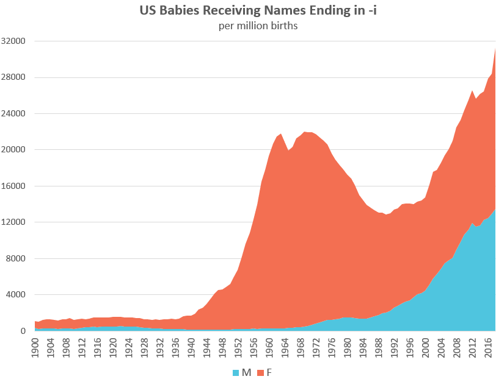

# 432 Class 09: 2024-02-13

[Main Website](https://thomaselove.github.io/432-2024/) | [Calendar](https://thomaselove.github.io/432-2024/calendar.html) | [Syllabus](https://thomaselove.github.io/432-syllabus-2024/) | [Notes](https://thomaselove.github.io/432-notes/) | [Contact Us](https://thomaselove.github.io/432-2024/contact.html) | [Canvas](https://canvas.case.edu) | [Data and Code](https://github.com/THOMASELOVE/432-data) | [Sources](https://github.com/THOMASELOVE/432-classes-2024/tree/main/sources)
:-----------: | :--------------: | :----------: | :---------: | :-------------: | :-----------: | :------------: |:------:
for everything | for deadlines | expectations | from Dr. Love | ways to get help | lab submission | for downloads | to read

## Today's Slides

Class | Date | HTML | Word | Quarto .qmd | Recording
:---: | :--------: | :------: | :------: | :------: | :-------------:
09 | 2024-02-13 | **[Slides 09](https://thomaselove.github.io/432-slides-2024/slides09.html)** | *[Word 09](https://thomaselove.github.io/432-slides-2024/slides09w.docx)* | **[Code 09](https://github.com/THOMASELOVE/432-slides-2024/blob/main/slides09.qmd)** | Visit [Canvas](https://canvas.case.edu/), select **Zoom** and **Cloud Recordings**

## Announcements

1. We're back to in-person education today at 1 PM in our usual room E321-323 Robbins Hall.
2. I've posted a slightly revised version of the Lab 3 sketch to our Shared Drive, where I've augmented the rubric for Questions 3 and 5.
3. The [Minute Paper after Class 9](https://bit.ly/432-2024-min-09) is due Wednesday 2024-02-14 at noon. You'll find it at <https://bit.ly/432-2024-min-09>.
4. A bonus question for Quiz 1 is **now** available on [Campuswire](https://campuswire.com/). Look for the **Quiz 1 Bonus Question: "How to be a modern scientist"** post (it's #40). Responses are due to [Campuswire](https://campuswire.com/) by the time the Quiz is due, which is Tuesday 2024-02-27 at noon. The bonus question will be worth approximately 3 points for a complete and well-written response, with some partial credit available.

## On the Project Plans.

Current Status of Project A Plans [can be found here](https://github.com/THOMASELOVE/432-classes-2024/blob/main/projectA/plans.md)

1. Your project should have a meaningful title (not containing the words “432” or “Project” or “Proposal” or “Plan”) but rather something describing your actual data and plans. Please keep the main title to no more than 80 characters, including spaces. Avoid deadwood like "The Analysis of" or "Analyzing" or "Effects of" or "factors associated with" in titles. Don't use acronyms, initialisms or abbreviations in titles which confuse the reader. Your readers for assignments in 432 include: other students in this class, the TAs, and Dr. Love.
2. If I've changed your title on the [plan status page](https://github.com/THOMASELOVE/432-classes-2024/blob/main/projectA/plans.md), for heaven's sake, adopt the new title, or improve it in light of what I've written above. Do not just regurgitate the original title I didn't like.
3. More of you could have used a useful subtitle to frame your work, especially if your title only touches on one of your two research questions.
4. A tibble, when you print it, shows only the first ten rows. A data frame that is not a tibble does not do that. Make sure you have a tibble before you get to Section 4 and have to print your data frame, or I will return your plan to you to fix this issue. Nothing is a more obvious sign that you didn't bother to look closely at the HTML.
5. Your Project A plan needs to have 10 labeled Sections, not 8, 9 or 12. Things are placed in these sections so that the TAs and I can find them quickly. Do not make our life more challenging in this regard.
6. Your description of your data set in Section 1 is important, as is every other part of this plan. Do not neglect it.
7. I recommend you strongly consider upgrading R to version 4.3.2, since it's been around since October 2023, and is thus quite stable now. I expect R version 4.3.3 to come out in March or April 2024.
8. Spelling, grammar and proper use of complete English sentences all count. Don't neglect these fundamentals.

## Today's Data

comes from [NHANES, specifically the 2011-12 administration](https://wwwn.cdc.gov/nchs/nhanes/continuousnhanes/overview.aspx?BeginYear=2011).

## More Resources that might help you (besides our Course [Notes](https://thomaselove.github.io/432-notes/))

- [Journal Articles with Quarto](https://quarto.org/docs/journals/)
- [What are Pseudo R-squareds?](https://stats.oarc.ucla.edu/other/mult-pkg/faq/general/faq-what-are-pseudo-r-squareds/) from UCLA.

## One Last Thing

[Labeling the x and y axes: Here’s a quick example where a bit of care can make a big difference](https://statmodeling.stat.columbia.edu/2023/01/26/labeling-the-x-and-y-axes-heres-a-quick-example-where-a-bit-of-care-can-make-a-big-difference/) by Andrew Gelman

- The post is made in reference to [this article at Namerology from Laura Wattenberg](https://namerology.com/2020/08/20/the-three-ages-of-i-names-an-american-tale/) and the graph shown below, and is meant to show that even a generally good graph (like this one) can be improved with some attention to details.

## One Additional Last Thing

Something like 219 million people have been born on [St. Valentine's Day](https://en.wikipedia.org/wiki/Valentine%27s_Day), February 14, including...

- [Anna Howard Shaw](https://en.wikipedia.org/wiki/Anna_Howard_Shaw), [Jimmy Hoffa](https://en.wikipedia.org/wiki/Jimmy_Hoffa), [Michael Bloomberg](https://en.wikipedia.org/wiki/Michael_Bloomberg), 
[Teller](https://en.wikipedia.org/wiki/Teller_(magician)), [Frederick Douglass](https://en.wikipedia.org/wiki/Frederick_Douglass), [Noriko Sakai](https://en.wikipedia.org/wiki/Noriko_Sakai)
- [Kris Aquino](https://en.wikipedia.org/wiki/Kris_Aquino), [Terry Gross](https://en.wikipedia.org/wiki/Terry_Gross), [Mark Rutte](https://en.wikipedia.org/wiki/Mark_Rutte), [Rob Thomas](https://en.wikipedia.org/wiki/Rob_Thomas_(musician)), [Ken Levine](https://en.wikipedia.org/wiki/Ken_Levine_(screenwriter)), [Renée Fleming](https://en.wikipedia.org/wiki/Ren%C3%A9e_Fleming)
- [Carl Bernstein](https://en.wikipedia.org/wiki/Carl_Bernstein), [Eugene Fama](https://en.wikipedia.org/wiki/Eugene_Fama), [Edinson Cavani](https://en.wikipedia.org/wiki/Edinson_Cavani), [Ángel Di Maria](https://en.wikipedia.org/wiki/%C3%81ngel_Di_Mar%C3%ADa), [Jadeveon Clowney](https://en.wikipedia.org/wiki/Jadeveon_Clowney), [Jim Kelly](https://en.wikipedia.org/wiki/Jim_Kelly), 
- [Drew Bledsoe](https://en.wikipedia.org/wiki/Drew_Bledsoe), [Woody Hayes](https://en.wikipedia.org/wiki/Woody_Hayes), [Mel Allen](https://en.wikipedia.org/wiki/Mel_Allen), [Jules Asner](https://en.wikipedia.org/wiki/Jules_Asner), [Risa Hirako](https://en.wikipedia.org/wiki/Risa_Hirako), [Gregory Hines](https://en.wikipedia.org/wiki/Gregory_Hines)
- [Meg Tilly](https://www.imdb.com/name/nm0000672/), [Florence Henderson](https://www.imdb.com/name/nm0001341/), [Deeksha Seth](https://en.wikipedia.org/wiki/Deeksha_Seth), [John Barrymore](https://en.wikipedia.org/wiki/John_Barrymore), [Jack Benny](https://en.wikipedia.org/wiki/Jack_Benny), [Simon Pegg](https://www.imdb.com/name/nm0670408/)
- [Freddie Highmore](https://www.imdb.com/name/nm0383603/), [Danai Gurira](https://www.imdb.com/name/nm1775091/), [Jake Lacy](https://www.imdb.com/name/nm3821405/), [Hazel McCallion](https://en.wikipedia.org/wiki/Hazel_McCallion)

and me. Yes, with the last name "Love". It was a lot less cute when I was a kid.

[Lots of other things](https://en.wikipedia.org/wiki/February_14) have happened on February 14, too.

## Can I still see your show?

[Curtains, the musical](https://www.hudsonplayers.com/now-playing), in which I play Christopher Belling, is going well. If you'd like to go, please visit <https://www.hudsonplayers.com/> to reserve your tickets, but act quickly. There are a few seats left for the evening shows on February 23 and 24. All other performances are sold out. If you're coming to the show, I hope you'll hang around in the lobby afterwards for a few moments to meet the cast and say hello (we appear less than 3 minutes after the curtain closes.)

