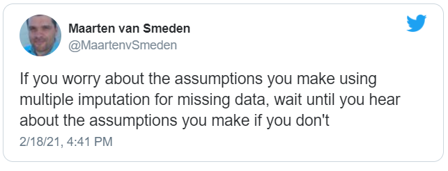
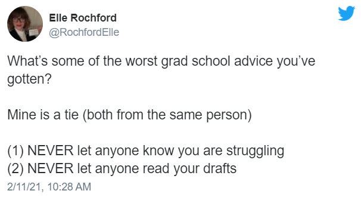

# 432 Class 10: 2024-02-15

[Main Website](https://thomaselove.github.io/432-2024/) | [Calendar](https://thomaselove.github.io/432-2024/calendar.html) | [Syllabus](https://thomaselove.github.io/432-syllabus-2024/) | [Notes](https://thomaselove.github.io/432-notes/) | [Contact Us](https://thomaselove.github.io/432-2024/contact.html) | [Canvas](https://canvas.case.edu) | [Data and Code](https://github.com/THOMASELOVE/432-data) | [Sources](https://github.com/THOMASELOVE/432-classes-2024/tree/main/sources)
:-----------: | :--------------: | :----------: | :---------: | :-------------: | :-----------: | :------------: |:------:
for everything | for deadlines | expectations | from Dr. Love | ways to get help | lab submission | for downloads | to read

## Today's Slides

Class | Date | HTML | Word | Quarto .qmd | Recording
:---: | :--------: | :------: | :------: | :------: | :-------------:
10 | 2024-02-15 | **[Slides 10](https://thomaselove.github.io/432-slides-2024/slides10.html)** | *[Word 10](https://thomaselove.github.io/432-slides-2024/slides10w.docx)* | **[Code 10](https://github.com/THOMASELOVE/432-slides-2024/blob/main/slides10.qmd)** | Visit [Canvas](https://canvas.case.edu/), select **Zoom** and **Cloud Recordings**

## Announcements

1. Feedback on the Minute Paper after Class 9 [is available now](https://bit.ly/432-2024-min-09-feedback).
2. Feedback on the Project A Plans has arrived (in your email and on Canvas) for most of you, and for the rest, it is **coming this evening**. See the [Project A Plan Status page here](https://github.com/THOMASELOVE/432-classes-2024/blob/main/projectA/plans.md) for more details.
3. Grades and feedback on Lab 3 are available in the Course Grading Roster on our Shared Google Drive.
    - The class average on this Lab was a bit lower than the previous Labs.
    - I reserve the right to decide to reweight the Labs at the end of the term, depending on what happens in Labs 4-7 and Lab 8.
4. I've added the `cutpointr` package to our [list of R packages to install](https://thomaselove.github.io/432-2024/software.html#r-packages-to-install).
5. I've adjusted the class [Calendar](https://thomaselove.github.io/432-2024/calendar.html) to put January at the bottom and reduce some scrolling.

## Agenda and Supplemental Materials

Today's class includes discussion of the following topics:

1. Building a logistic regression model with complete cases, with single imputation (facilitated by `mice`) and with multiple imputation (facilitated by `aregImpute()`) and fitting models using both `lrm()` and `glm()` after imputation.
2. Discussion of key summaries of goodness-of-fit in a logistic regression model
3. A new way to obtain a plot of an ROC curve
4. Building a confusion matrix, and forming a decision rule to maximize (Sensitivity + Specificity)
5. Assessing collinearity in a logistic regression fit
6. Using robust sandwich variance estimates within a multiple imputation for a logistic regression

In addition to our [Notes](https://thomaselove.github.io/432-notes/) and [Sources](https://github.com/THOMASELOVE/432-classes-2024/tree/main/sources) pages, I commend to you these two sources:

- Vetter T et al. 2018 [Diagnostic Testing and Decision-Making: Beauty Is Not Just in the Eye of the Beholder](https://www.ncbi.nlm.nih.gov/pmc/articles/PMC6135476/)
- [Vignette for the `cutpointr` package](https://cran.r-project.org/web/packages/cutpointr/vignettes/cutpointr.html)

After today, the main topics we plan to discuss regarding logistic regression that won't have been covered yet are:

1. Diagnostics and residuals
2. Variable Selection

## What Should I Be Working On?

1. [Lab 4](https://thomaselove.github.io/432-2024/lab4.html) is due Tuesday 2024-02-20 at noon.
2. If I have asked you to revise your Project A Plan, be sure to resubmit it to Canvas (including .qmd, .html and .Rds files) by the deadline I've given you.
3. Once I've approved your Project A Plan, there should be nothing on our end stopping you from completing the Project A Portfolio, which is due Monday 2024-03-18 at Noon.
4. Look for the **Quiz 1 Bonus Question: "How to be a modern scientist"** post (it's #40) on  [Campuswire](https://campuswire.com/). Responses are due Tuesday 2024-02-27 at noon. The bonus question will be worth about 3 points for a complete and well-written response, with some partial credit available. You will receive the rest of Quiz 1 on Thursday 2024-02-22 at 5 PM.

## Finally...

[Curtains, the musical](https://www.hudsonplayers.com/now-playing), in which I play Christopher Belling, is going well. If you'd like to go, please visit <https://www.hudsonplayers.com/> to reserve your tickets, but act quickly. There are a few seats left for the evening shows on February 23 and 24. All other performances are sold out. If you're coming to the show, hang around in the lobby afterwards for a few moments to meet the cast, if you like.

