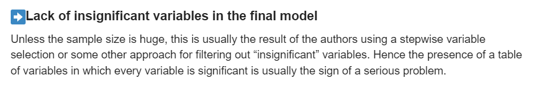
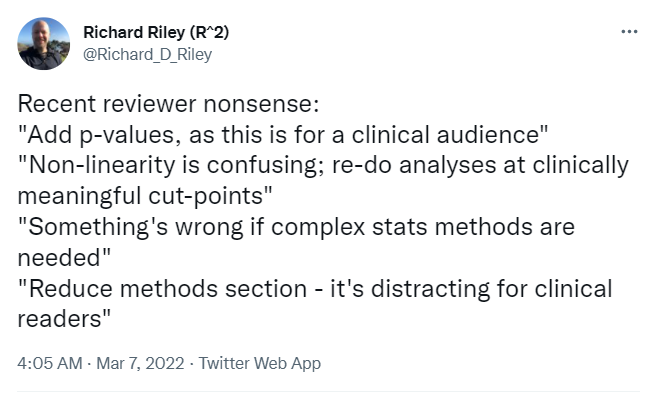

# 432 Class 11: 2024-02-20

[Main Website](https://thomaselove.github.io/432-2024/) | [Calendar](https://thomaselove.github.io/432-2024/calendar.html) | [Syllabus](https://thomaselove.github.io/432-syllabus-2024/) | [Notes](https://thomaselove.github.io/432-notes/) | [Contact Us](https://thomaselove.github.io/432-2024/contact.html) | [Canvas](https://canvas.case.edu) | [Data and Code](https://github.com/THOMASELOVE/432-data) | [Sources](https://github.com/THOMASELOVE/432-classes-2024/tree/main/sources)
:-----------: | :--------------: | :----------: | :---------: | :-------------: | :-----------: | :------------: |:------:
for everything | for deadlines | expectations | from Dr. Love | ways to get help | lab submission | for downloads | to read

## Today's Slides

Class | Date | HTML | Word | Quarto .qmd | Recording
:---: | :--------: | :------: | :------: | :------: | :-------------:
11 | 2024-02-20 | **[Slides 11](https://thomaselove.github.io/432-slides-2024/slides11.html)** | *[Word 11](https://thomaselove.github.io/432-slides-2024/slides11w.docx)* | **[Code 11](https://github.com/THOMASELOVE/432-slides-2024/blob/main/slides11.qmd)** | Visit [Canvas](https://canvas.case.edu/), select **Zoom** and **Cloud Recordings**

  

Source: [DataMethods Discourse](https://discourse.datamethods.org/t/author-checklist/3407#arrow_rightlack-of-insignificant-variables-in-the-final-model-25)

## Announcements

1. There is a [Minute Paper after Class 11](https://bit.ly/432-2024-min-11) due Wednesday 2024-02-21 at noon. The link is <https://bit.ly/432-2024-min-11>.
2. Remember to complete the bonus question for Quiz 1 **now** available on [Campuswire](https://campuswire.com/). Look for the **Quiz 1 Bonus Question: "How to be a modern scientist"** post (it's #40).
3. Project A Plan Review Status [is available here](https://github.com/THOMASELOVE/432-classes-2024/blob/main/projectA/plans.md).
4. [Quiz 1](https://github.com/THOMASELOVE/432-quizzes-2024/tree/main/quiz1) will be made available to you on Thursday 2024-02-22 at 5 PM.

## Some References Related to Today's Material

- A.I. McLeod and C. Xu [bestglm package vignette (pdf)](http://cran.nexr.com/web/packages/bestglm/vignettes/bestglm.pdf)
- Daniel Cho on [Logistic Regression: Feature Selection Methods](https://rpubs.com/ohcsnad/feature_selection_methods) also using the Pima Indians diabetes data
    - [Pima Indians Diabetes data on Kaggle](https://www.kaggle.com/datasets/uciml/pima-indians-diabetes-database)
- [glmnet website](https://glmnet.stanford.edu/index.html) "Lasso and Elastic-Net Regularized Generalized Linear Models"
- Friedman J, Tibshirani R, Hastie T (2010). "[Regularization Paths for Generalized Linear Models via Coordinate Descent](https://www.jstatsoft.org/article/view/v033i01)" Journal of Statistical Software, 33(1), 1–22. [doi:10.18637/jss.v033.i01](https://www.jstatsoft.org/article/view/v033i01).
- Frank Harrell and others at DataMethods Discourse [Statistical Problems to Document and to Avoid: Checklist for Authors](https://discourse.datamethods.org/t/author-checklist/3407)
- Frank Harrell on [Use of Stepwise Variable Selection](https://discourse.datamethods.org/t/author-checklist/3407#arrow_rightuse-of-stepwise-variable-selection-24)
    - Gary Smith [Step away from stepwise](https://journalofbigdata.springeropen.com/articles/10.1186/s40537-018-0143-6)
    - Georg Heinze, Christine Wallisch and Daniela Dunkler on [Variable selection – A review and recommendations for the practicing statistician](https://onlinelibrary.wiley.com/doi/full/10.1002/bimj.201700067)
- [Sample Size / Number of Variables for Regression Models](https://discourse.datamethods.org/t/reference-collection-to-push-back-against-common-statistical-myths/1787#sample-size-number-of-variables-for-regression-models-6)
 
## Self-Promotion

[Curtains, the musical](https://www.hudsonplayers.com/now-playing), in which I play Christopher Belling, has its final two performances Friday and Saturday February 23 and 24. If any tickets remain, they may be purchased at [this link](https://www.hudsonplayers.com/).

## One Last Thing

  
