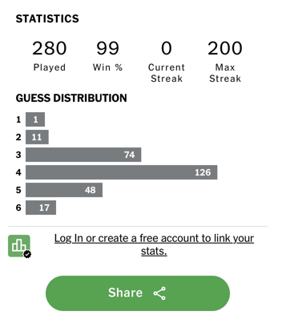

# 432 Class 13: 2024-02-27

[Main Website](https://thomaselove.github.io/432-2024/) | [Calendar](https://thomaselove.github.io/432-2024/calendar.html) | [Syllabus](https://thomaselove.github.io/432-syllabus-2024/) | [Notes](https://thomaselove.github.io/432-notes/) | [Contact Us](https://thomaselove.github.io/432-2024/contact.html) | [Canvas](https://canvas.case.edu) | [Data and Code](https://github.com/THOMASELOVE/432-data) | [Sources](https://github.com/THOMASELOVE/432-classes-2024/tree/main/sources)
:-----------: | :--------------: | :----------: | :---------: | :-------------: | :-----------: | :------------: |:------:
for everything | for deadlines | expectations | from Dr. Love | ways to get help | lab submission | for downloads | to read

## Today's Slides

Class | Date | HTML | Word | Quarto .qmd | Recording
:---: | :--------: | :------: | :------: | :------: | :-------------:
13 | 2024-02-27 | **[Slides 13](https://thomaselove.github.io/432-slides-2024/slides13.html)** | *[Word 13](https://thomaselove.github.io/432-slides-2024/slides13w.docx)* | **[Code 13](https://github.com/THOMASELOVE/432-slides-2024/blob/main/slides13.qmd)** | Visit [Canvas](https://canvas.case.edu/), select **Zoom** and **Cloud Recordings**

 from [XKCD](https://xkcd.com/2582)

## Announcements

1. Grades and an answer sketch for Quiz 1 will be available in time for Thursday's class. I will discuss the Quiz in detail in class Thursday.
    - The list of people who responded to the Bonus Question in time (by noon today) on Campuswire [is posted here](https://github.com/THOMASELOVE/432-quizzes-2024/blob/main/quiz1/README.md#who-has-provided-a-response-to-the-bonus-question). Let me know immediately if your name is not listed but you completed the Bonus Question on time.
2. There is no Minute Paper this week. The next Minute Paper comes after Class 15.
3. Lab 4 grades and feedback are now posted to the Course Grading Roster on our Shared Drive.

## Supplemental Materials / Sources for Today

Today we'll focus on:

1. thinking about power issues through retrospective design, and
2. robust linear models, specifically using Huber weights, or bisquare weights as well as a brief introduction to quantile regression.

Here are the key references:

- Andrew Gelman [Statistics is like basketball, or knitting](https://statmodeling.stat.columbia.edu/2016/03/11/statistics-is-like-basketball-or-knitting/) Blog Post 2016-03-11.
- Andrew Gelman [You need 16 times the sample size to estimate an interaction than to estimate a main effect](https://statmodeling.stat.columbia.edu/2018/03/15/need-16-times-sample-size-estimate-interaction-estimate-main-effect/) Blog Post 2018-03-15.
- Andrew Gelman and John Carlin [Beyond Power Calculations: Assessing Type S (Sign) and Type M (Magnitude) Errors](https://github.com/THOMASELOVE/432-sources/blob/main/pdf/Gelman_Carlin_2014_Beyond_Power_Calculations.pdf)
- https://stats.oarc.ucla.edu/r/dae/robust-regression/ provides a relevant example, which I drew on in building today's slides about the crimestat data.
- Some theoretical discussion of the motivation behind various robust regression procedures can be found in [Robust Regression](https://socialsciences.mcmaster.ca/jfox/Books/Companion/appendices/Appendix-Robust-Regression.pdf) by John Fox and Sanford Weisberg.

## Three Last Things

1. You might enjoy [Words Said by No Academic Ever](https://phdcomics.com/comics/archive.php?comicid=2048) or perhaps [Academic Wordle](https://phdcomics.com/comics/archive.php?comicid=2051) from Jorge Cham at PhD Comics. 
2. My Wordle streak died Saturday, at 200 in a row.

3. Here are four pictures from *Curtains*, which closed on Saturday after a very successful run.

