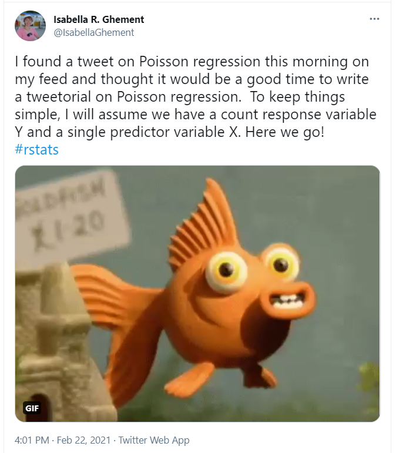

# 432 Class 15: 2024-03-05

[Main Website](https://thomaselove.github.io/432-2024/) | [Calendar](https://thomaselove.github.io/432-2024/calendar.html) | [Syllabus](https://thomaselove.github.io/432-syllabus-2024/) | [Notes](https://thomaselove.github.io/432-notes/) | [Contact Us](https://thomaselove.github.io/432-2024/contact.html) | [Canvas](https://canvas.case.edu) | [Data and Code](https://github.com/THOMASELOVE/432-data) | [Sources](https://github.com/THOMASELOVE/432-classes-2024/tree/main/sources)
:-----------: | :--------------: | :----------: | :---------: | :-------------: | :-----------: | :------------: |:------:
for everything | for deadlines | expectations | from Dr. Love | ways to get help | lab submission | for downloads | to read

## Today's Slides

Class | Date | HTML | Word | Quarto .qmd | Recording
:---: | :--------: | :------: | :------: | :------: | :-------------:
15 | 2024-03-05 | **[Slides 15](https://thomaselove.github.io/432-slides-2024/slides15.html)** | *[Word 15](https://thomaselove.github.io/432-slides-2024/slides15w.docx)* | **[Code 15](https://github.com/THOMASELOVE/432-slides-2024/blob/main/slides15.qmd)** | Visit [Canvas](https://canvas.case.edu/), select **Zoom** and **Cloud Recordings**

## Announcements

1. The Calendar has changed at the end of the semester to reflect a revision to the available times for 432 Project B Presentations.
2. The `crimestat` data set discussed in Class 13 is now available at the 432 data page.
3. There is a Minute Paper after Class 15 due tomorrow (Wednesday 2024-03-06) at noon. The link is <https://bit.ly/432-2024-minute-15>.
4. Next week is Spring Break. After this Thursday, our next class (class 17) will be held on Tuesday 2024-03-19.
5. A reminder that we will not hold TA office hours on March 9-16. TA office hours return on Sunday 2024-03-17, although Campuswire will be open the week of Spring Break.

# A Few Project A Tips

Remember that your Project A portfolio is due the **Monday** after Spring Break, 2024-03-18 at Noon.

- The [Project A portfolio](https://thomaselove.github.io/432-2024/projA.html#the-project-a-portfolio) consists of these four elements:
    1. a Quarto (.qmd) file containing containing one unnumbered, and 13 numbered sections (10 of which come from the Plan.)
    2. an HTML result of applying the Quarto "portfolio" file to your data
    3. a copy of your tidy data and link to where Professor Love can obtain the raw data freely
    4. a [video presentation](https://thomaselove.github.io/432-2024/projA.html#the-presentation) (not to exceed 5 minutes) presenting what you feel is the single most important finding of your project. 
    
All 35 project A plans [have been accepted](https://github.com/THOMASELOVE/432-classes-2024/blob/main/projectA/plans.md).

## How Will Project A Be Graded?

- Your project A grade is out of 100 points. 20 of those points were available as part of the plan, while the remaining 80 will be awarded based on all of the materials in your portfolio. We expect to get your Project A grade to you on Thursday 2024-03-28.
- The TAs will spend most of their time in Sections 8-10 of your Quarto and HTML files, addressing specific questions Dr. Love will prepare that follow [the Project A proposal instructions for those sections](https://thomaselove.github.io/432-2024/projA.html#new-section-8.-linear-regression-analyses) closely.
- Dr. Love will first watch your videos before he reviews your Discussion (Section 10 of HTML) and then TA comments on specific elements of (Sections 8-9 of your HTML) before he digs further into your work, among other things to ensure that you've acted on any requests associated with the accepted version of your Project A plan.
- Dr. Love will then determine your project A grade. I expect that (1) the video and (2) the Discussion section will have more to do with your final score than you might think. So will typographical, syntax and grammatical errors.

## Why I use `read_csv()` all the time, and never use `read.csv()` anymore

1. `read_csv()` is much faster than `read.csv()`, 
2. `read_csv()` provides a progress meter and a compact method for specifying column types,
3. `read_csv()` will read compressed files automatically,
4. `read_csv()` automatically creates a tibble, and
5. `read_csv()` allows me to speed the process of debugging by providing much more useful error messages about which rows are problematic, especially when the error is non-fatal.

- For more details, see the [Data import section of R for Data Science](https://r4ds.hadley.nz/data-import.html).
- From Josh Gonzales at Medium: [read_csv(): The Best Way to import CSV data into R](https://medium.com/r-tutorials/r-functions-daily-read-csv-3c418c25cba4)

## What should I do if I have a problem with Normality in my linear model (Project A)?

1. Not all problems can be fixed with power transformations and non-linear terms.
2. You should describe what the residual plots show, accurately.
3. If there is a problem with the residual plots, use that fact in making a decision about which model to select as your final model. 
4. If you have to select a final model with residual plot problems, describe how those problems might affect your conclusions.

## Exploding Coefficients and Problems in Logistic Regression

Sometimes, we see people fitting models to predict a binary outcome using a predictor which completely determines that outcome (for example, if predictor > 12, then outcome is always no, or if predictor = "Yes" then outcome is always no.)

Take a look at [this toy example with explosive coefficients](https://rpubs.com/TELOVE/explosion_logistic_432) to see one way in which this problem can emerge and what to do about it.

## Some Common Problems You Can Fix in your Project A

1. Sometimes, we see people failing to drop levels of a categorical predictor after combining levels. Use the `droplevels()` command.
2. Sometimes, we see people fitting restricted cubic splines or polynomials either to categorical predictors or to quantitative predictors with just a few observed values.
3. Remember that it's perfectly fine to add fewer than the maximum additional degrees of freedom beyond the main effects model [if necessary, so long as you include at least one non-linear term](https://thomaselove.github.io/432-2024/projA.html#new-section-8.-linear-regression-analyses)
4. Suppose you decide to create a decision rule for a logistic regression model. Feel encouraged to make a rational choice other than 0.5 for the cutoff.
5. When you build a plot of the ROC curve for your final model, be sure it provides the same C statistic value as you get from the `lrm` fit to the data, and that you also provide the validation-adjusted C statistic estimate for that model.
6. Something we've seen **a lot** in looking at Quarto files people have sent is the failure to include a blank line **before and after** every **heading and subheading**, and **every block of code**. This is a problem.
7. Don't name the file `projectAproposal.Rmd` when it's not your proposal. A good generic name would be `2024-03-10_432_projA.Rmd` or `432projectA_2024-03-10.Rmd` assuming it's the version from that date (2024-03-10).
8. Be sure to run the spell-check, and ideally, have someone else read through your work.
9. We hate scrolling windows in HTML output caused by code that runs too long on one line. Use the ENTER key liberally to help avoid this problem, and check your HTML to see if it is happening.
10. Make sure your headings are in an appropriate order, and that you have 13 main sections in your Project, as laid out in the sample project. Check your HTML to make sure the headings make sense, for instance, `10`, then `10.1`, then `10.1.1.` is OK, but `10`, then `10.0.1` isn't OK.
11. If you're loading a package not on our [R packages list](https://thomaselove.github.io/432-2024/software.html#r-packages-to-install), then you should definitely indicate why you're doing this at the top of your work as you load it in a short comment. Also, don't load elements of [the core `tidyverse`](https://www.tidyverse.org/packages/) separately: load them with `tidyverse` only.

## On Naming Things

Naming things is hard. [Jenny Bryan has you covered](https://speakerdeck.com/jennybc/how-to-name-files). The three principles are:

- machine readable
- human readable
- play well with default ordering

A perfectly lovely **file name** convention for project A was `2023-03-20_yourname_432projA.xxx`

Naming R data frames (tibbles) can be challenging, as well. I'll add 

- don't name tibbles things that are also data frames or functions or other things in R
- don't name tibbles things that make no sense without a very detailed explanation
- 8 characters is usually a good maximum for a tibble name that you'll use often
- if you insist on separating words in a tibble name, use underscores.

## Project A presentation video advice

Make sure that you introduce yourself when you start to speak, over your title slide if you are working alone. We’re happy to see your face during the presentation, but this isn’t mandatory. If you are working with a partner, each of you should introduce yourself at the beginning, and let me know who’s speaking first.

(Essentially) every word and every image/table/chart in your slides can and should come directly from the materials contained in your HTML portfolio.

We suggest you develop about 8 slides. This should include…

- A title slide
- A couple of slides to describe the Subjects, Outcome and Predictors
    - Make sure we understand who the subjects are, how they were selected, what the outcome is and why we should care about it, and what predictors are involved in the model you’ll show.
- Several slides showing meaningful statistical findings (What should we learn from your model?)
    - What does the model (don’t show us details of multiple models in the presentation) say about the relationship between the outcome and the predictors?
    - You’re only showing us one model (of models A, B, Y and Z) in the presentation.
    - How well does this model fit the data you have, and how well might it fit in new data?
- A couple of slides discussing next steps
    - It is unlikely that you’ll have a model that is truly satisfactory all on its own, so what could be done to improve it that you cannot already do with the data you have? What other data could be collected, how could the measures be refined, could you design a study to get to a more convincing answer?

## This Week's Agenda: Regression on Count Outcomes

- Today's slides will be used both today and (perhaps) Thursday (in Class 16).

This week, we'll be presenting some key ideas on fitting models for count outcomes. Counts are discrete (rather than continuous) and counts are typically integers (0, 1, 2, 3 and so on) and cannot be made more precise. Relevant materials are available in Chapters 24-26 of the [Course Notes](https://thomaselove.github.io/432-notes/). 

Methods we will touch on this week include Poisson regression and negative binomial regression, along with augmentations of these two approaches to inflate the number of zeros predicted, and also "hurdle" versions which specify one process for zero counts and another for positive counts. In Chapters 24-26, we discuss all of these, as well as another approach, called a tobit (or censored) regression model.

Here's [a link to the start of the "tweetorial"](https://twitter.com/IsabellaGhement/status/1363957122787024901) on some key practical aspects of understanding Poisson regression models.

- For more on rootograms, check out Kleiber C Zeileis A [Visualizing Count Data Regressions Using Rootograms](rootograms_2016.pdf) from *The American Statistician* 2016.
- For more on Vuong's test, check out Vuong, QH (1989) Likelihood ratio tests for model selection and non-nested hypotheses. *Econometrica*, 57:307-333.

## What You Should Be Working On

1. [Minute Paper after Class 15](https://bit.ly/432-2024-minute-15), due Wednesday 2023-03-06 at noon.
2. [Project A Portfolio](https://thomaselove.github.io/432-2024/projA.html), due Monday 2023-03-18 at noon.

