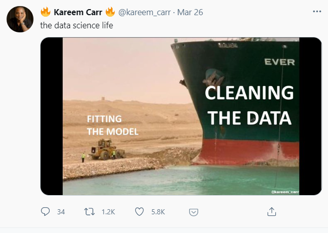
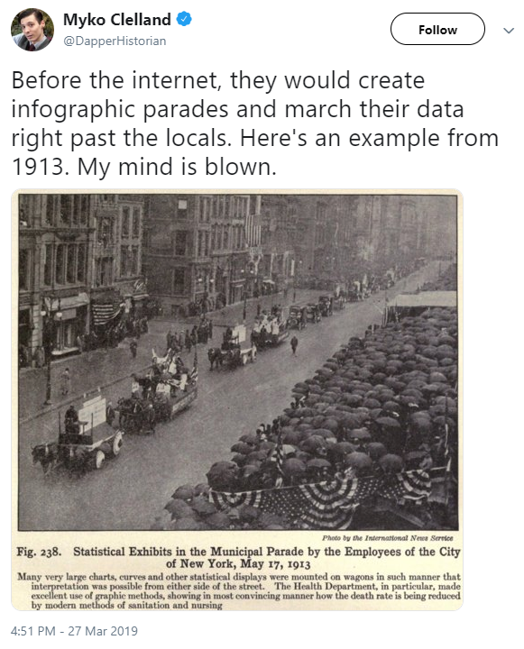

# 432 Class 17: 2024-03-19

[Main Website](https://thomaselove.github.io/432-2024/) | [Calendar](https://thomaselove.github.io/432-2024/calendar.html) | [Syllabus](https://thomaselove.github.io/432-syllabus-2024/) | [Notes](https://thomaselove.github.io/432-notes/) | [Contact Us](https://thomaselove.github.io/432-2024/contact.html) | [Canvas](https://canvas.case.edu) | [Data and Code](https://github.com/THOMASELOVE/432-data) | [Sources](https://github.com/THOMASELOVE/432-classes-2024/tree/main/sources)
:-----------: | :--------------: | :----------: | :---------: | :-------------: | :-----------: | :------------: |:------:
for everything | for deadlines | expectations | from Dr. Love | ways to get help | lab submission | for downloads | to read

## Today's Slides

Class | Date | HTML | Word | Quarto .qmd | Recording
:---: | :--------: | :------: | :------: | :------: | :-------------:
17 | 2024-03-19 | **[Slides 17](https://thomaselove.github.io/432-slides-2024/slides17.html)** | *[Word 17](https://thomaselove.github.io/432-slides-2024/slides17w.docx)* | **[Code 17](https://github.com/THOMASELOVE/432-slides-2024/blob/main/slides17.qmd)** | Visit [Canvas](https://canvas.case.edu/), select **Zoom** and **Cloud Recordings**

## Announcements

1. There is a Minute Paper after Class 17 due Wednesday 2024-03-20 at noon. The link will appear **by class time**.
2. For those of you who have not yet submitted all of [Project A](https://thomaselove.github.io/432-2024/projA.html) to [Canvas](https://canvas.case.edu), be aware of the following deadlines:
    - if all of your work is submitted between now and Wednesday 2024-03-20 at noon, you will lose 5 points (out of the 80 available for the post-proposal work.)
    - if all of your work is submitted between Wednesday at noon and Friday 2024-03-22 at 11:59 PM, you will lose 10 points.
    - and that's it. We won't accept work received after Friday at 11:59 PM.
    - If you're having a problem, contact us now. Email Dr. Love if you need to speak with him.
3. Bonus credit for Project A will be awarded to all students who responded to Note #80 on [Campuswire](https://campuswire.com/) by noon today. We'll share a few of those ideas in class Thursday, but the current list is posted to our Shared Drive.
4. I don't know when we'll get you feedback on Project A, but I'm aiming (tentatively) for the end of next week.
5. The [Project B proposal form](https://bit.ly/432-2024-projectB-proposal-form) will open on Thursday 2024-03-21, and we will also discuss Project B's instructions in class 18 (Thursday).
6. I've added [the **tidytext** package](https://github.com/juliasilge/tidytext) to our list of R packages to install. We'll use a function from it in Class 25.
7. Lab 5 grades and feedback are now available in the Course Grading Roster on our Shared Drive. At the end of the semester, I will take the average of the 6 largest grades (out of Labs 1-7) to help create your Lab grade, before I factor in Lab 8. If that average is below 70%, I will change it to 70%, assuming you have missed/skipped at most one Lab during the term.

## Today's Agenda

Regression on Ordinal Multi-Categorical Outcomes (day 1 of 2)

## Sources from Today's Slides

- [UCLA site on Ordinal Logistic Regression](http://stats.idre.ucla.edu/r/dae/ordinal-logistic-regression/)
- [UCLA site on Multinomial Logistic Regression](https://stats.oarc.ucla.edu/r/dae/multinomial-logistic-regression/)
- [MASS reference manual (pdf)](https://cran.r-project.org/web/packages/MASS/MASS.pdf)
- Frank Harrell on [Model Uncertainty, Penalization, and Parsimony (pdf)](http://hbiostat.org/talks/iscb98.pdf)
- Frank E. Harrell [Regression Modeling Strategies](https://github.com/THOMASELOVE/432-sources/blob/main/pdf/Harrell_Regression_Modeling_Strategies_2015_2e_protected.pdf), 2nd Edition, 2015. (password-protected PDF)

## Recent Examples: Regression on Ordinal Outcomes ([Notes, Chapter 27](https://thomaselove.github.io/432-notes/ordinaloutcome.html))

These references come from the list at <https://github.com/THOMASELOVE/432-sources/blob/main/recent.md>.

- Bhattacharyay S et al. (2022) [The leap to ordinal: Detailed functional prognosis after traumatic brain injury with a flexible modelling approach](https://www.ncbi.nlm.nih.gov/pmc/articles/PMC9255749/) PLoS One. 2022; 17(7): e0270973. [DOI](https://doi.org/10.1371%2Fjournal.pone.0270973)
- Nawi MAA et al. (2022) [The patterns of facial fractures in traumatic brain injury (TBI) patients using ordinal regression: a retrospective study of five years](https://www.ncbi.nlm.nih.gov/pmc/articles/PMC9581734/) AIMS Neurosci. 2022; 9(3): 345–357. [DOI](https://doi.org/10.3934%2FNeuroscience.2022019)
- Glasgow TW et al. (2022) [Eat, sleep, play: health behaviors and their association with psychological health among cancer survivors in a nationally representative sample](https://www.ncbi.nlm.nih.gov/pmc/articles/PMC9190125/) BMC Cancer. 2022; 22: 648. [DOI](https://doi.org/10.1186%2Fs12885-022-09718-7)
- Akinosoglou K et al. (2023) [Efficacy and safety of early soluble urokinase plasminogen receptor plasma-guided anakinra treatment of COVID-19 pneumonia: A subgroup analysis of the SAVE-MORE randomised trial](https://www.ncbi.nlm.nih.gov/pmc/articles/PMC9791950/) eClinicalMedicine. 2023 Feb; 56: 101785. [DOI](https://doi.org/10.1016%2Fj.eclinm.2022.101785)
- Bersch I et al. (2022) [A Prediction Model for Various Treatment Pathways of Upper Extremity in Tetraplegia](https://www.ncbi.nlm.nih.gov/pmc/articles/PMC9397669/) Front Rehabil Sci. 2022; 3: 889577. [DOI](https://doi.org/10.3389%2Ffresc.2022.889577)

## Other Recent Examples

Other topics presented in the [list of recent sources](https://github.com/THOMASELOVE/432-sources/blob/main/recent.md) include:

- Splines to account for Non-Linearity in Linear or Generalized Linear Models (Notes, Chapters 13 and many others)
- Model Validation, LASSO, Ridge Regression
- Single and Multiple Imputation Strategies (Notes, Chapters 7 and 17 and others)
- Nomograms (Notes, Chapter 14 and others)
- Methods for Regression on Count Outcomes (Notes, Chapters 24-26)

and some additional topics coming soon.

## One Last Thing

