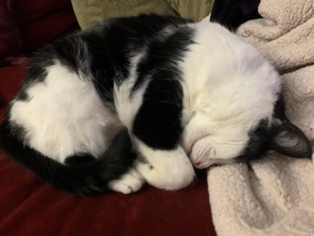

# 432 Class 18: 2024-03-21

[Main Website](https://thomaselove.github.io/432-2024/) | [Calendar](https://thomaselove.github.io/432-2024/calendar.html) | [Syllabus](https://thomaselove.github.io/432-syllabus-2024/) | [Notes](https://thomaselove.github.io/432-notes/) | [Contact Us](https://thomaselove.github.io/432-2024/contact.html) | [Canvas](https://canvas.case.edu) | [Data and Code](https://github.com/THOMASELOVE/432-data) | [Sources](https://github.com/THOMASELOVE/432-classes-2024/tree/main/sources)
:-----------: | :--------------: | :----------: | :---------: | :-------------: | :-----------: | :------------: |:------:
for everything | for deadlines | expectations | from Dr. Love | ways to get help | lab submission | for downloads | to read

## Today's Slides

Class | Date | HTML | Word | Quarto .qmd | Recording
:---: | :--------: | :------: | :------: | :------: | :-------------:
18 | 2024-03-21 | **[Slides 18](https://thomaselove.github.io/432-slides-2024/slides18.html)** | *[Word 18](https://thomaselove.github.io/432-slides-2024/slides18w.docx)* | **[Code 18](https://github.com/THOMASELOVE/432-slides-2024/blob/main/slides18.qmd)** | Visit [Canvas](https://canvas.case.edu/), select **Zoom** and **Cloud Recordings**

## Announcements

1. Feedback on the Minute Paper after Class 17 **will be posted** in time for class.
2. The [Project B Proposal Form](https://bit.ly/432-2024-projectB-proposal-form) will be open **by class time**, and is due at noon on Wednesday 2024-04-10.
3. I will share some of the ideas people mentioned as part of the Bonus for Project A on Campuswire, and add some of my own **by class time**.

## Today's Agenda

- We will discuss the [Project B instructions](https://thomaselove.github.io/432-2024/projB.html) in class today.
- Regression on Multi-Categorical Outcomes

## Today's Agenda

Regression on Ordinal Multi-Categorical Outcomes (day 2 of 2)

## Sources from Today's Slides

Don't forget about the [recent examples using ordinal regression here](https://github.com/THOMASELOVE/432-sources/blob/main/recent.md#methods-for-regression-on-ordinal-outcomes-notes-chapter-27), and Chapter 27 of our Course [Notes](https://thomaselove.github.io/432-notes/), which has an example involving an outcome with **five** ordinal levels.

- Jeffrey Simonoff [Analyzing Categorical Data](https://pages.stern.nyu.edu/~jsimonof/AnalCatData/), Springer.
- [UCLA site on Ordinal Logistic Regression](http://stats.idre.ucla.edu/r/dae/ordinal-logistic-regression/)
- [UCLA site on Multinomial Logistic Regression](https://stats.oarc.ucla.edu/r/dae/multinomial-logistic-regression/)
- [MASS reference manual (pdf)](https://cran.r-project.org/web/packages/MASS/MASS.pdf)

## What Should I Be Working On?

1. [Lab 6](https://thomaselove.github.io/432-2024/lab6.html) due at noon Tuesday 2024-03-26.
2. [Lab 7](https://thomaselove.github.io/432-2024/lab7.html) is due at noon the following Tuesday 2024-04-02.
3. It's never too early to work on [Lab 8](https://thomaselove.github.io/432-2024/lab8.html), although it's not due until Monday 2024-04-29 at noon.
4. The Project B proposal form is due at noon on Wednesday 2024-04-10.

 This would be our cat, Fuzzington. He's 15.

## One Last Thing.

[Rohrer and Arslan’s nonet: More ideas regarding interactions in statistical models](https://statmodeling.stat.columbia.edu/2023/02/27/rohrer-and-arslans-nonet-more-ideas-regarding-interactions-in-statistical-models/) from Andrew Gelman's blog, 2023-02-27. Here's my favorite quote:

> "When you fit a regression to observational data and you get a coefficient that makes no sense, you should be able interpret it using interactions."
