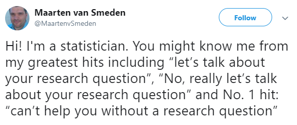

# 432 Class 18: 2024-03-21

[Main Website](https://thomaselove.github.io/432-2024/) | [Calendar](https://thomaselove.github.io/432-2024/calendar.html) | [Syllabus](https://thomaselove.github.io/432-syllabus-2024/) | [Notes](https://thomaselove.github.io/432-notes/) | [Contact Us](https://thomaselove.github.io/432-2024/contact.html) | [Canvas](https://canvas.case.edu) | [Data and Code](https://github.com/THOMASELOVE/432-data) | [Sources](https://github.com/THOMASELOVE/432-classes-2024/tree/main/sources)
:-----------: | :--------------: | :----------: | :---------: | :-------------: | :-----------: | :------------: |:------:
for everything | for deadlines | expectations | from Dr. Love | ways to get help | lab submission | for downloads | to read

## Today's Slides

Class | Date | HTML | Word | Quarto .qmd | Recording
:---: | :--------: | :------: | :------: | :------: | :-------------:
18 | 2024-03-21 | **[Slides 18](https://thomaselove.github.io/432-slides-2024/slides18.html)** | *[Word 18](https://thomaselove.github.io/432-slides-2024/slides18w.docx)* | **[Code 18](https://github.com/THOMASELOVE/432-slides-2024/blob/main/slides18.qmd)** | Visit [Canvas](https://canvas.case.edu/), select **Zoom** and **Cloud Recordings**

## NEW!! SLIDES UPDATED AFTER CLASS!!!

I have updated the slides for Class 18 making the following changes (all slide numbers refer to these new versions, which have 62 slides)...

1. Title slide now indicates updated after class.
2. Added base::mean to the conflicts_prefer() list in slide 3.
3. Slide 6 now indicates I may add additional options for the second outcome model in Project B.
4. Added slide 23 about centering the quantitative predictor, duration
5. In slide 24, fixed the bulleted sentence and adjusted modelA so it uses centered duration.
6. Fixed text on bottom of slide 26
7. Fixed text in middle of slide 28
8. Fixed text on bottom of slides 29-32
9. Added slide 55 which describes the primary differences between orm() and lrm() fits.

I am sorry about this.

## Announcements

1. Feedback on the Minute Paper after Class 17 is available at <https://bit.ly/432-2024-min-17-feedback>.
2. The [Project B Proposal Form](https://bit.ly/432-2024-projectB-proposal-form) is now open, and is due at noon on Wednesday 2024-04-10.
3. Our Shared Drive contains a document with the ideas people mentioned as part of the Bonus for Project A on Campuswire.
4. Progress on Project A review [is described (sort of) here](https://github.com/THOMASELOVE/432-classes-2024/blob/main/projectA/portfolio_review.md).
5. I enjoyed this article highlighting some individual stories from the American Statistical Association [Celebrating Women in Statistics and Data Science](https://magazine.amstat.org/blog/2024/03/01/celebratingwomen/?_zs=3OQUl1&_zl=Q0HU9).

## Today's Agenda

- Regression on Ordinal Multi-Categorical Outcomes (day 2/2)
    - Proportional Odds Logistic Regression
    - Ordinal Logistic Regression
- We will discuss the [Project B instructions](https://thomaselove.github.io/432-2024/projB.html) in class today - the materials I plan to discuss are described in the first part of today's slides.
    - The instructions refer to the Fall 2022 431 Project B instructions on using NHANES data. I will change this to [the Fall 2023 version](https://thomaselove.github.io/431-projectB-2023/data2.html) as soon as I can. 
    - I reserve the right to edit the instructions between now and one week from today to potentially increase the number of options for the model for your second outcome. Right now, it says the following (I may add other possibilities):

> The model for your second outcome must use a different approach than you used for Outcome 1. For this model, you can use any of the three options above, or you may use:

> - A linear or binary logistic model fit using a Bayesian engine, or
> - A weighted linear regression model.

## Sources from Today's Slides

Don't forget about the [recent examples using ordinal regression here](https://github.com/THOMASELOVE/432-sources/blob/main/recent.md#methods-for-regression-on-ordinal-outcomes-notes-chapter-27), and Chapter 27 of our Course [Notes](https://thomaselove.github.io/432-notes/), which has an example involving an outcome with **five** ordinal levels.

- Jeffrey Simonoff [Analyzing Categorical Data](https://pages.stern.nyu.edu/~jsimonof/AnalCatData/), Springer.
- [UCLA site on Ordinal Logistic Regression](http://stats.idre.ucla.edu/r/dae/ordinal-logistic-regression/)
- [UCLA site on Multinomial Logistic Regression](https://stats.oarc.ucla.edu/r/dae/multinomial-logistic-regression/)
- [MASS reference manual (pdf)](https://cran.r-project.org/web/packages/MASS/MASS.pdf)

## What Should I Be Working On?

1. [Lab 6](https://thomaselove.github.io/432-2024/lab6.html) due at noon Tuesday 2024-03-26
    - (1) Kaplan-Meier estimation for time-to-event data
    - (2) modeling a count outcome
2. [Lab 7](https://thomaselove.github.io/432-2024/lab7.html) is due at noon the following Tuesday 2024-04-02
    - (1) modeling an ordered categorical outcome and
    - (2) binary logistic regression with multiple imputation
3. It's never too early to work on [Lab 8](https://thomaselove.github.io/432-2024/lab8.html), although it's not due until Monday 2024-04-29 at noon.
4. The [Project B Proposal Form](https://bit.ly/432-2024-projectB-proposal-form) is due at noon on Wednesday 2024-04-10.

 This would be our cat, Fuzzington. He's 15.

## One Last Thing.

[Rohrer and Arslan’s nonet: More ideas regarding interactions in statistical models](https://statmodeling.stat.columbia.edu/2023/02/27/rohrer-and-arslans-nonet-more-ideas-regarding-interactions-in-statistical-models/) from Andrew Gelman's blog, 2023-02-27. Here's my favorite quote:

> "When you fit a regression to observational data and you get a coefficient that makes no sense, you should be able interpret it using interactions."
