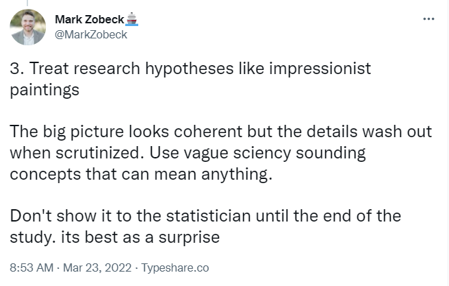
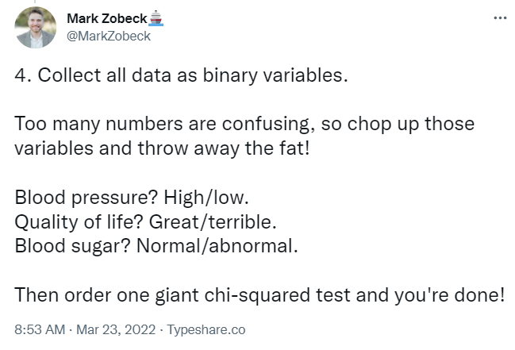
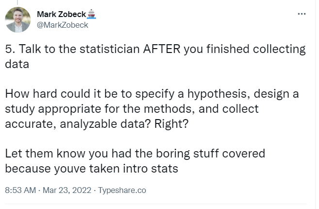
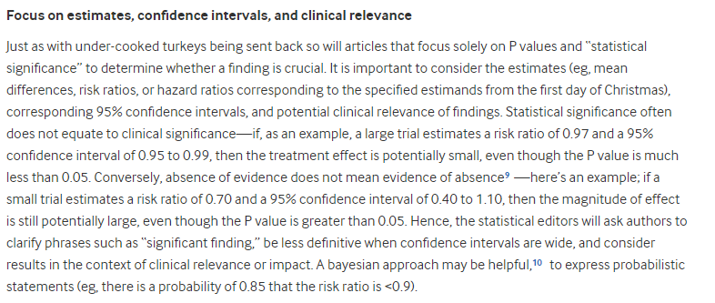

# 432 Class 19: 2024-03-26

[Main Website](https://thomaselove.github.io/432-2024/) | [Calendar](https://thomaselove.github.io/432-2024/calendar.html) | [Syllabus](https://thomaselove.github.io/432-syllabus-2024/) | [Notes](https://thomaselove.github.io/432-notes/) | [Contact Us](https://thomaselove.github.io/432-2024/contact.html) | [Canvas](https://canvas.case.edu) | [Data and Code](https://github.com/THOMASELOVE/432-data) | [Sources](https://github.com/THOMASELOVE/432-classes-2024/tree/main/sources)
:-----------: | :--------------: | :----------: | :---------: | :-------------: | :-----------: | :------------: |:------:
for everything | for deadlines | expectations | from Dr. Love | ways to get help | lab submission | for downloads | to read

## Today's Slides

Class | Date | HTML | Word | Quarto .qmd | Recording
:---: | :--------: | :------: | :------: | :------: | :-------------:
19 | 2024-03-26 | **[Slides 19](https://thomaselove.github.io/432-slides-2024/slides19.html)** | *[Word 19](https://thomaselove.github.io/432-slides-2024/slides19w.docx)* | **[Code 19](https://github.com/THOMASELOVE/432-slides-2024/blob/main/slides19.qmd)** | Visit [Canvas](https://canvas.case.edu/), select **Zoom** and **Cloud Recordings**

## Announcements

1. There is a Minute Paper after Class 19 due Wednesday 2024-03-27 at noon. The link will appear **by class time**.
2. We will post the Lab 6 answer sketch on Wednesday 2024-03-27 at noon.

## Today's Agenda

Regression on (Nominal) Multi-Categorical Outcomes

---

## Details on Zobeck's ideas

- [Source (Mark Zobeck's twitter thread)](https://twitter.com/MarkZobeck/status/1506615109170442244)
- The two references in the final image are dead links. Instead, use these:
    - [Statistical Problems to Document and To Avoid](https://discourse.datamethods.org/t/author-checklist/3407)
    - [Glossary of Statistical Terms (from Frank Harrell)](https://hbiostat.org/glossary/)

Also of interest are:

- [A CHecklist for statistical Assessment of Medical Papers (the CHAMP statement): explanation and elaboration](https://bjsm.bmj.com/content/55/18/1009.2)
- [Biostatistical Modeling Plan](https://www.fharrell.com/post/modplan) from Frank Harrell.

I plan to discuss these issues in Class 26 of the course.
 
## Sources from Today's Slides

- [UCLA site on Multinomial Logistic Regression](https://stats.oarc.ucla.edu/r/dae/multinomial-logistic-regression/)
- Links to [information on Alan Agresti's books](https://users.stat.ufl.edu/~aa/) and numerous other useful things.
- Penn State STAT 504 [materials on Multinomial Logistic Regression](https://online.stat.psu.edu/stat504/lesson/8)
- [Julia Silge's example on volcano eruptions](https://juliasilge.com/blog/multinomial-volcano-eruptions/)
- Hosmer DW Lemeshow S Sturdivant RX (2013) [Applied Logistic Regression, 3rd Edition, Wiley](https://www.wiley.com/en-us/Applied+Logistic+Regression%2C+3rd+Edition-p-9780470582473)

## Recent Examples of Regression on Nominal Multi-Categorical Outcomes ([Notes](https://thomaselove.github.io/432-notes/), Chapter 28)

These come from our [recent Sources](https://github.com/THOMASELOVE/432-sources/blob/main/recent.md#methods-for-regression-on-nominal-multi-categorical-outcomes-notes-chapter-28).

- Bendera A et al. (2022) [Factors Associated with Low Uptake of Medical Male Circumcision Among Adolescent Boys in Tanzania: A Multinomial Logistic Regression Modeling](https://www.ncbi.nlm.nih.gov/pmc/articles/PMC9785118/) HIV AIDS (Auckl). 2022; 14: 565–575. [DOI](https://doi.org/10.2147%2FHIV.S387380)
- Verhoeven J et al. (2022) [Patient characteristics and dispatch responses of urinary tract infections in a prehospital setting in Copenhagen, Denmark: a retrospective cohort study](https://www.ncbi.nlm.nih.gov/pmc/articles/PMC9736713/) BMC Prim Care. 2022; 23: 319. [DOI](https://doi.org/10.1186%2Fs12875-022-01915-4)
- Sakala N and Kaombe TM (2022) [Analysing outlier communities to child birth weight outcomes in Malawi: application of multinomial logistic regression model diagnostics](https://www.ncbi.nlm.nih.gov/pmc/articles/PMC9701370/) BMC Pediatr. 2022; 22: 682. [DOI](https://doi.org/10.1186%2Fs12887-022-03742-z)
- Klu D et al. (2022) [Determinants of communication on sexual issues between adolescents and their parents in the Adaklu district of the Volta region, Ghana: a multinomial logistic regression analysis](https://www.ncbi.nlm.nih.gov/pmc/articles/PMC9044737/) Reprod Health. 2022; 19: 101. [DOI](https://doi.org/10.1186%2Fs12978-022-01402-0)
- Yokoi Y et al. (2022) [How Sleep Quality Relates to Bodily and Oral Symptoms: An Analysis from Japanese National Statistics](https://www.ncbi.nlm.nih.gov/pmc/articles/PMC9690173/) Healthcare (Basel). 2022 Nov; 10(11): 2298. [DOI](https://doi.org/10.3390%2Fhealthcare10112298)

## One Last Thing

From [On the 12th Day of Christmas, a Statistician Sent to Me...](https://www.bmj.com/content/379/bmj-2022-072883)

