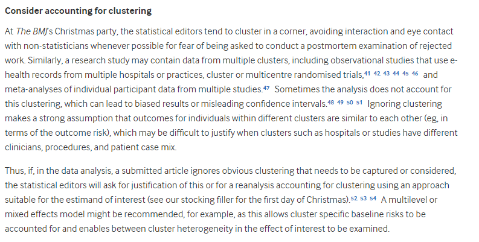

# 432 Class 20: 2024-03-28

[Main Website](https://thomaselove.github.io/432-2024/) | [Calendar](https://thomaselove.github.io/432-2024/calendar.html) | [Syllabus](https://thomaselove.github.io/432-syllabus-2024/) | [Notes](https://thomaselove.github.io/432-notes/) | [Contact Us](https://thomaselove.github.io/432-2024/contact.html) | [Canvas](https://canvas.case.edu) | [Data and Code](https://github.com/THOMASELOVE/432-data) | [Sources](https://github.com/THOMASELOVE/432-classes-2024/tree/main/sources)
:-----------: | :--------------: | :----------: | :---------: | :-------------: | :-----------: | :------------: |:------:
for everything | for deadlines | expectations | from Dr. Love | ways to get help | lab submission | for downloads | to read

## Today's Slides

Class | Date | HTML | Word | Quarto .qmd | Recording
:---: | :--------: | :------: | :------: | :------: | :-------------:
20 | 2024-03-28 | **[Slides 20](https://thomaselove.github.io/432-slides-2024/slides20.html)** | *[Word 20](https://thomaselove.github.io/432-slides-2024/slides20.docx)* | **[Code 20](https://github.com/THOMASELOVE/432-slides-2024/blob/main/slides20.qmd)** | Visit [Canvas](https://canvas.case.edu/), select **Zoom** and **Cloud Recordings**

## Announcements

1. Feedback on the Minute Paper after Class 19 **will be posted** in time for class.
2. The Lab 6 answer sketch **should be posted** to our Shared Drive. Grades and feedback on Lab 6 will be posted Tuesday.
3. I hope to also have feedback for you on Project A by today's class. We'll see if we hit that deadline or not. 

## Our Starting Point for Today

- [An Introduction to Hierarchical Modeling (Visual Explanation)](http://mfviz.com/hierarchical-models/) by [Michael Freeman](http://mfviz.com/)

## Other Resources for Hierarchical Data Mentioned in the Class 20 Slides

- [Generalized Linear Mixed Models FAQ](https://bbolker.github.io/mixedmodels-misc/glmmFAQ.html) by Ben Bolker and others. Other work by Ben Bolker includes...
    - [Some notes on (generalized) linear mixed models](https://bbolker.github.io/morelia_2018/notes/glmm.html)
    - [Some worked examples of these models](https://bbolker.github.io/mixedmodels-misc/ecostats_chap.html)
- [The Introduction to Mixed Models from Environmental Computing](http://environmentalcomputing.net/mixed-models/) folks at the University of New South Wales, Australia.
- [Workshop on Linear mixed effects models from the Quebec Centre for Biodiversity Science](https://wiki.qcbs.ca/r_workshop6) developed by Catherine Baltazar, Dalal Hanna and Jacob Ziegler
- [A useful bibliography of mixed effect regression models](https://joelemartinez.com/2015/07/14/mixed-effect-models/) by Joel Eduardo Martinez
- [Using `sjPlot` in R to summarize Mixed Models in HTML tables](https://strengejacke.github.io/sjPlot/articles/tab_mixed.html) and [Using `sjPlot` to Plot Model Estimates](https://strengejacke.github.io/sjPlot/articles/plot_model_estimates.html)
- [UCLA example using mixed effects logistic regression](https://stats.idre.ucla.edu/r/dae/mixed-effects-logistic-regression/)

## What Should I Be Working On?

1. [Lab 7](https://thomaselove.github.io/432-2024/lab7.html) is due at noon Tuesday 2024-04-02.
2. The [Project B proposal form](https://bit.ly/432-2024-projectB-proposal-form) is due at noon on Wednesday 2024-04-10.
3. It's never too early to work on [Lab 8](https://thomaselove.github.io/432-2024/lab8.html), although it's not due until Monday 2024-04-29 at noon.

## Some Machine Learning Sources from Frank Harrell (and friends)

I've been asked to talk a bit about machine learning, so I'll send you to my main sources.

- Frank Harrell's [Road Map for Choosing Between Statistical Modeling and Machine Learning](https://www.fharrell.com/post/stat-ml/)
- Drew Levy on [Navigating Statistical Modeling and Machine Learning](https://www.fharrell.com/post/stat-ml2/) is a great follow-up discussion of Frank's main post.
- Frank also has a video of a talk called [Musings on Statistical Models vs. Machine Learning in Health Research](https://www.fharrell.com/talk/mlhealth/) available.
- Another helpful video on some related issues from Frank is [Controversies in Predictive Modeling, Machine Learning, and Validation](https://www.fharrell.com/talk/stratos19/).

## One Last Thing.

From [On the 12th Day of Christmas, a Statistician Sent to Me...](https://www.bmj.com/content/379/bmj-2022-072883)

