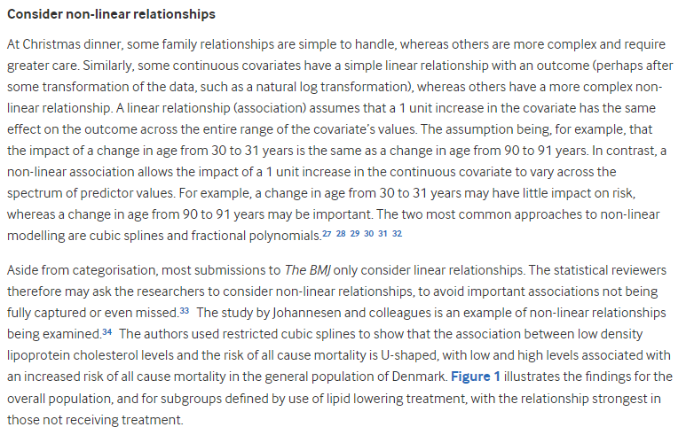
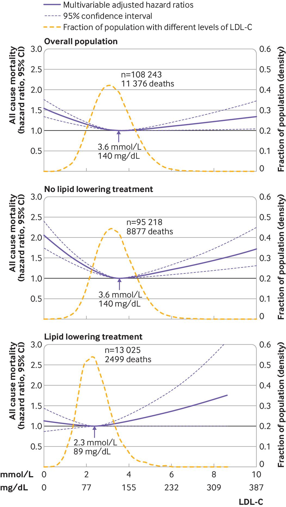

# 432 Class 21: 2024-04-02

[Main Website](https://thomaselove.github.io/432-2024/) | [Calendar](https://thomaselove.github.io/432-2024/calendar.html) | [Syllabus](https://thomaselove.github.io/432-syllabus-2024/) | [Notes](https://thomaselove.github.io/432-notes/) | [Contact Us](https://thomaselove.github.io/432-2024/contact.html) | [Canvas](https://canvas.case.edu) | [Data and Code](https://github.com/THOMASELOVE/432-data) | [Sources](https://github.com/THOMASELOVE/432-classes-2024/tree/main/sources)
:-----------: | :--------------: | :----------: | :---------: | :-------------: | :-----------: | :------------: |:------:
for everything | for deadlines | expectations | from Dr. Love | ways to get help | lab submission | for downloads | to read

## Today's Slides

Class | Date | HTML | Word | Quarto .qmd | Recording
:---: | :--------: | :------: | :------: | :------: | :-------------:
21 | 2024-04-02 | **[Slides 21](https://thomaselove.github.io/432-slides-2024/slides21.html)** | *[Word 21](https://thomaselove.github.io/432-slides-2024/slides21w.docx)* | **[Code 21](https://github.com/THOMASELOVE/432-slides-2024/blob/main/slides21.qmd)** | Visit [Canvas](https://canvas.case.edu/), select **Zoom** and **Cloud Recordings**

## Announcements

1. There is a Minute Paper after Class 21 due Wednesday 2024-04-03 at noon. The link will appear **by class time**.
2. Grades and feedback on Lab 6 should be posted **by class time** to our Course Grading Roster on the Shared Drive.
3. An answer sketch for Lab 7 should appear on our Shared Drive at noon on Wednesday 2024-04-03.
4. We do not have class next Tuesday 2024-04-09 (instructor's decision). Please enjoy the eclipse on Monday!

## Today's Agenda

Comparing Survival Curves, and an introduction to fitting and interpreting Cox Proportional Hazards Models for Time-to-Event Outcomes

## Sources related to Today's Slides

[Course Notes](https://thomaselove.github.io/432-notes/), Chapters 29-31.

- [Survival Analysis](https://epirhandbook.com/en/survival-analysis.html) in [The Epidemiologist R Handbook](https://epirhandbook.com/en/index.html)
- [survminer web site](https://rpkgs.datanovia.com/survminer/index.html)
- [survminer cheat sheet (pdf)](https://rpkgs.datanovia.com/survminer/survminer_cheatsheet.pdf)
- Chen and Peace (2011) [Clinical Trial Data Analysis Using R](https://www.taylorfrancis.com/books/mono/10.1201/b10478/clinical-trial-data-analysis-using-ding-geng-din-chen-karl-peace)
- [Time-dependent Models Vignette (pdf)](https://cran.r-project.org/web/packages/survival/vignettes/timedep.pdf)

## Recent Open-Source Papers using Methods for Time-to-Event Data 

- Chen L et al. (2021) [Prognostic Nutritional Index (PNI) in Patients With Breast Cancer Treated With Neoadjuvant Chemotherapy as a Useful Prognostic Indicator](https://www.ncbi.nlm.nih.gov/pmc/articles/PMC8042235/) Front Cell Dev Biol. 2021; 9: 656741. [DOI](https://doi.org/10.3389%2Ffcell.2021.656741)
- Onaga C et al. (2022) [High expression of SLC20A1 is less effective for endocrine therapy and predicts late recurrence in ER-positive breast cancer](https://www.ncbi.nlm.nih.gov/pmc/articles/PMC9126382/) PLoS One. 2022; 17(5): e0268799. [DOI](https://doi.org/10.1371%2Fjournal.pone.0268799)
- Morris TP et al. (2019) [Proposals on Kaplan–Meier plots in medical research and a survey of stakeholder views: KMunicate](https://www.ncbi.nlm.nih.gov/pmc/articles/PMC6773317/) BMJ Open. 2019; 9(9): e030215. [DOI](https://doi.org/10.1136%2Fbmjopen-2019-030215)
- Liang H et al. (2022) [Development and validation of a novel prognosis prediction model for patients with myelodysplastic syndrome](https://www.ncbi.nlm.nih.gov/pmc/articles/PMC9597308/) Front Oncol. 2022; 12: 1014504. [DOI](https://doi.org/10.3389%2Ffonc.2022.1014504)
- Dzinza R and Ngwira A (2022) [Comparing parametric and Cox regression models using HIV/AIDS survival data from a retrospective study in Ntcheu district in Malawi](https://www.ncbi.nlm.nih.gov/pmc/articles/PMC9523851/) J Public Health Res. 2022 Jul; 11(3): 22799036221125328. [DOI](https://doi.org/10.1177%2F22799036221125328)
- Cirillo C et al. (2022) [Predictors of in-hospital mortality in critically ill patients with COVID-19: a large dual tertiary centre study](https://www.ncbi.nlm.nih.gov/pmc/articles/PMC9716800/) BMJ Open. 2022; 12(12): e059358. [DOI](https://doi.org/10.1136%2Fbmjopen-2021-059358)

## Next Time

In addition to finishing up our discussion of time-to-event data, next time we will remind you of some important elements of [Statistical Inference in the 21st Century: A World Beyond *p* < 0.05](https://amstat.tandfonline.com/toc/utas20/73/sup1) from 2019 in *The American Statistician* 

- I've also stored [the pdf here](https://github.com/THOMASELOVE/432-sources/blob/main/pdf/ASA_2019_A_World_Beyond.pdf).

## One Last Thing

From [On the 12th Day of Christmas, a Statistician Sent to Me...](https://www.bmj.com/content/379/bmj-2022-072883)

And here is that Figure 1...

