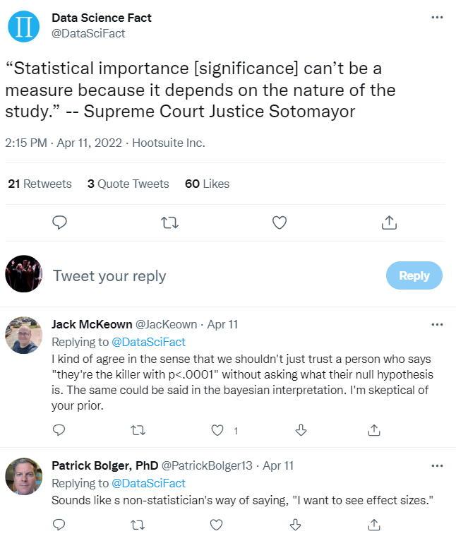
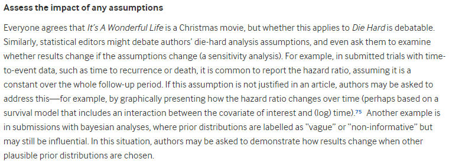

# 432 Class 22: 2024-04-04

[Main Website](https://thomaselove.github.io/432-2024/) | [Calendar](https://thomaselove.github.io/432-2024/calendar.html) | [Syllabus](https://thomaselove.github.io/432-syllabus-2024/) | [Notes](https://thomaselove.github.io/432-notes/) | [Contact Us](https://thomaselove.github.io/432-2024/contact.html) | [Canvas](https://canvas.case.edu) | [Data and Code](https://github.com/THOMASELOVE/432-data) | [Sources](https://github.com/THOMASELOVE/432-classes-2024/tree/main/sources)
:-----------: | :--------------: | :----------: | :---------: | :-------------: | :-----------: | :------------: |:------:
for everything | for deadlines | expectations | from Dr. Love | ways to get help | lab submission | for downloads | to read

## Today's Slides

Class | Date | HTML | Word | Quarto .qmd | Recording
:---: | :--------: | :------: | :------: | :------: | :-------------:
22 | 2024-04-04 | **[Slides 22](https://thomaselove.github.io/432-slides-2024/slides22.html)** | *[Word 22](https://thomaselove.github.io/432-slides-2024/slides22w.docx)* | **[Code 22](https://github.com/THOMASELOVE/432-slides-2024/blob/main/slides22.qmd)** | Visit [Canvas](https://canvas.case.edu/), select **Zoom** and **Cloud Recordings**

## Announcements

1. Feedback on the Minute Paper after Class 21 **will be posted** in time for class.
2. The Lab 7 answer sketch **should be posted** to our Shared Drive. Grades and feedback on Lab 7 will be posted one week from today, on Thursday 2024-04-11.
3. Monday office hours are cancelled for 2024-04-08, due to the Eclipse.
4. We do not have class next Tuesday (instructor's decision), so our next class (Class 23) will be 2024-04-11.
5. Enjoy the eclipse on Monday!

## What Should I Be Working On?

1. The [Project B Proposal Form](https://bit.ly/432-2024-projectB-proposal-form) is due next **Wednesday 2024-04-10** at Noon. 
    - We've cancelled class on Tuesday 2024-04-09 in part to give you more time to get this finished and submitted by the deadline.
    - If you're not going to be able to make that deadline, please contact Dr. Love as soon as possible so he can at least get your final presentation scheduled.
2. [Lab 8](https://github.com/THOMASELOVE/432-classes-2024/tree/main/lab8) work by students in 432 to date.
    - Remember that you can do Lab 8 at any time before its deadline, which is specified in the Course Calendar.

## Today's Agenda

- Fitting Cox Regression Models with `cpm()` from the `rms` package
- [Statistical Inference in the 21st Century: A World Beyond *p* < 0.05](https://amstat.tandfonline.com/toc/utas20/73/sup1) from 2019 in *The American Statistician*

## Sources Related to Today's Class

[Course Notes](https://thomaselove.github.io/432-notes/), Chapters 29-31 discuss survival analysis.

- [Survival Analysis](https://epirhandbook.com/en/survival-analysis.html) in [The Epidemiologist R Handbook](https://epirhandbook.com/en/index.html)
- [survminer web site](https://rpkgs.datanovia.com/survminer/index.html)
- [survminer cheat sheet (pdf)](https://rpkgs.datanovia.com/survminer/survminer_cheatsheet.pdf)
- [Recent Papers that use Time-to-Event Data Methods](https://github.com/THOMASELOVE/432-sources/recent.md#methods-for-time-to-event-data-especially-cox-regression-and-kaplan-meier-estimates-notes-chapters-29-31)

[Statistical Inference in the 21st Century: A World Beyond *p* < 0.05](https://amstat.tandfonline.com/toc/utas20/73/sup1) from 2019 in *The American Statistician* 

- I've also stored [the pdf of the 2019 paper here](https://github.com/THOMASELOVE/432-sources/pdf/ASA_2019_A_World_Beyond.pdf).
- Don't forget about [Dr. Love's advice about having a tough conversation with someone about statistical significance and/or p values](https://github.com/THOMASELOVE/432-sources?tab=readme-ov-file#need-to-have-a-tough-talk-with-someone-about-statistical-significance-andor-p-values).

## From [On the 12th Day of Christmas, a Statistician Sent to Me...](https://www.bmj.com/content/379/bmj-2022-072883)

## One Last Thing: A checklist for data graphics

Here is a useful [checklist for data graphics](https://statmodeling.stat.columbia.edu/2022/03/15/a-checklist-for-data-graphics/) from Christian Hennig, as posted by Andrew Gelman, with a few comments.
