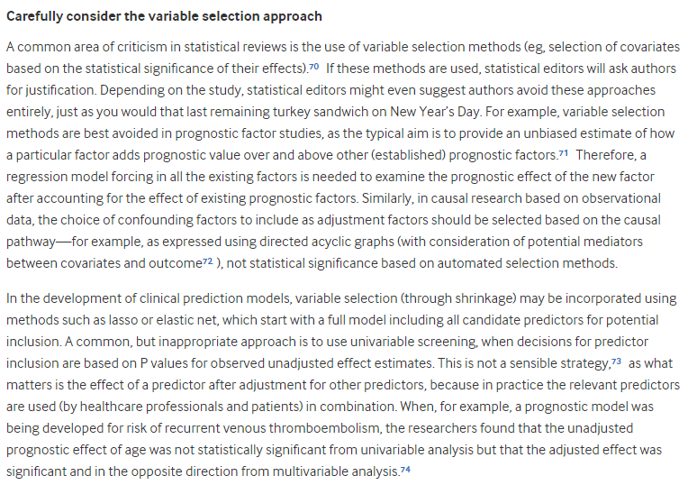

# 432 Class 24: 2024-04-16

[Main Website](https://thomaselove.github.io/432-2024/) | [Calendar](https://thomaselove.github.io/432-2024/calendar.html) | [Syllabus](https://thomaselove.github.io/432-syllabus-2024/) | [Notes](https://thomaselove.github.io/432-notes/) | [Contact Us](https://thomaselove.github.io/432-2024/contact.html) | [Canvas](https://canvas.case.edu) | [Data and Code](https://github.com/THOMASELOVE/432-data) | [Sources](https://github.com/THOMASELOVE/432-classes-2024/tree/main/sources)
:-----------: | :--------------: | :----------: | :---------: | :-------------: | :-----------: | :------------: |:------:
for everything | for deadlines | expectations | from Dr. Love | ways to get help | lab submission | for downloads | to read

## Today's Slides

Class | Date | HTML | Word | Quarto .qmd | Recording
:---: | :--------: | :------: | :------: | :------: | :-------------:
24 | 2024-04-16 | **[Slides 24](https://thomaselove.github.io/432-slides-2024/slides24.html)** | *[Word 24](https://thomaselove.github.io/432-slides-2024/slides24w.docx)* | **[Code 24](https://github.com/THOMASELOVE/432-slides-2024/blob/main/slides24.qmd)** | Visit [Canvas](https://canvas.case.edu/), select **Zoom** and **Cloud Recordings**

## Announcements

1. There is a Minute Paper after Class 24 due Wednesday 2024-04-17 at noon. The link will appear **by class time**.

## Today's Agenda

Using the tidymodels approach to build logistic models

## Sources for Today's Slides

- [Bayesian Logistic Regression with rstanarm](https://avehtari.github.io/modelselection/diabetes.html) by Aki Vehtari

Three articles by Jonah Gabry and Ben Goodrich:

- [How to Use the `rstanarm` Package](http://mc-stan.org/rstanarm/articles/rstanarm.html) 
- [Prior Distributions for `rstanarm` Models](http://mc-stan.org/rstanarm/articles/priors.html) 
- [Estimating Generalized Linear Models for Binary and Binomial Data with rstanarm](http://mc-stan.org/rstanarm/articles/binomial.html)

Also, don't forget about Max Kuhn and Julia Silge's [Tidy Modeling with R](https://www.tmwr.org/) and about the [main page for the tidymodels framework](https://www.tidymodels.org/).

## One Last Thing

From [On the 12th Day of Christmas, a Statistician Sent to Me...](https://www.bmj.com/content/379/bmj-2022-072883)

Aki Vehtari has a set of interesting [model selection tutorials and talks here](https://avehtari.github.io/modelselection/index.html).

