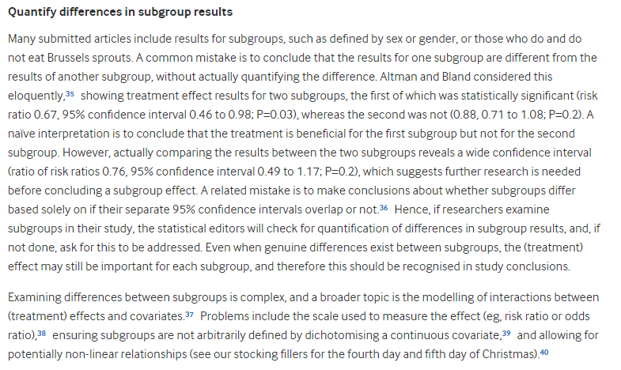

# 432 Class 25: 2024-04-18

[Main Website](https://thomaselove.github.io/432-2024/) | [Calendar](https://thomaselove.github.io/432-2024/calendar.html) | [Syllabus](https://thomaselove.github.io/432-syllabus-2024/) | [Notes](https://thomaselove.github.io/432-notes/) | [Contact Us](https://thomaselove.github.io/432-2024/contact.html) | [Canvas](https://canvas.case.edu) | [Data and Code](https://github.com/THOMASELOVE/432-data) | [Sources](https://github.com/THOMASELOVE/432-classes-2024/tree/main/sources)
:-----------: | :--------------: | :----------: | :---------: | :-------------: | :-----------: | :------------: |:------:
for everything | for deadlines | expectations | from Dr. Love | ways to get help | lab submission | for downloads | to read

## Today's Slides

Class | Date | HTML | Word | Quarto .qmd | Recording
:---: | :--------: | :------: | :------: | :------: | :-------------:
25 | 2024-04-18 | **[Slides 25](https://thomaselove.github.io/432-slides-2024/slides25.html)** | *[Word 25](https://thomaselove.github.io/432-slides-2024/slides25w.docx)* | **[Code 25](https://github.com/THOMASELOVE/432-slides-2024/blob/main/slides25.qmd)** | Visit [Canvas](https://canvas.case.edu/), select **Zoom** and **Cloud Recordings**

 [Source: XKCD](https://xkcd.com/1838)

## Announcements

1. Quiz 2 will be available to you by 5 PM today (2024-04-18).
2. Feedback on the Minute Paper after Class 24 **will be posted** in time for class.
3. Over Spring Break, I added [the **tidytext** package](https://github.com/juliasilge/tidytext) to our list of R packages to install. We'll use a function from it today.

## What Should I Be Working On (Besides Quiz 2)?

- [Lab 8](https://thomaselove.github.io/432-2024/lab8.html) is due Monday 2024-04-29 at noon.
    - Here is the [Lab 8 work](https://github.com/THOMASELOVE/432-classes-2024/tree/main/lab8) by students in 432 to date.
- [Project B](https://thomaselove.github.io/432-2024/projB.html)

## A Few References Related to K-Means Clustering

- [K-means clustering with tidy data principles](https://www.tidymodels.org/learn/statistics/k-means/) at the Tidymodels page.
- [Clustering in R – A Survival Guide on Cluster Analysis in R for Beginners!](https://data-flair.training/blogs/clustering-in-r-tutorial/)
- K-means Clustering chapter in [Exploratory Data Analysis with R](https://bookdown.org/rdpeng/exdata/k-means-clustering.html) by Roger Peng
- [YouTube: k-Means and Hierarchial Clustering using R-Studio](https://www.youtube.com/watch?v=tkAJT8gWBSY) by BioPandit.
- [A k-means example using the iris data](https://shiny.rstudio.com/gallery/kmeans-example.html) which you can explore (a little) via R Shiny
- [K-Means Clustering in R: Algorithm and Practical Examples](https://www.datanovia.com/en/lessons/k-means-clustering-in-r-algorith-and-practical-examples/)
- [What is Cluster analysis?](https://datascience.com.co/what-is-cluster-analysis-336362f15ed0) by Jose Miguel Arrieta
- [K-Means Clustering in R: Step-by-Step Example](https://www.statology.org/k-means-clustering-in-r/) at Statology
- [Hierarchical Clustering in R: Step-by-Step Example](https://www.statology.org/hierarchical-clustering-in-r/) at Statology
- [How many groups of Star Wars characters are there? R-squared and cross-validation approaches](https://joshuamrosenberg.com/posts/how-many-groups-of-star-wars-characters-are-there-r-squared-and-cross-validation-approaches/) by Joshua Rosenberg

## Palmer Penguins and Principal Components Analysis

- [PCA with penguins and recipes](https://allisonhorst.github.io/palmerpenguins/articles/pca.html) by Allison Horst
- [PCA and UMAP with tidymodels and #TidyTuesday cocktail recipes](https://juliasilge.com/blog/cocktail-recipes-umap/) by Julia Silge
- [Penguin data: Multivariate EDA](https://rpubs.com/friendly/penguin-biplots) by Michael Friendly
- [PCA Signal Extraction with recipes](https://recipes.tidymodels.org/reference/step_pca.html)
- [PCA with Tidymodels in R](https://cmdlinetips.com/2020/06/pca-with-tidymodels-in-r/)
- [A One-Stop Shop for Principal Component Analysis](https://towardsdatascience.com/a-one-stop-shop-for-principal-component-analysis-5582fb7e0a9c) by Matt Brems
- [Principal Component Analysis Explained Visually](https://setosa.io/ev/principal-component-analysis/) by Victor Powell and Lewis Lehe

## One Last Thing

From [On the 12th Day of Christmas, a Statistician Sent to Me...](https://www.bmj.com/content/379/bmj-2022-072883)

