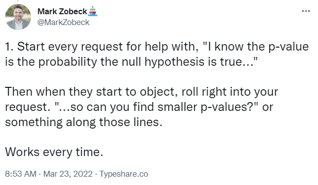
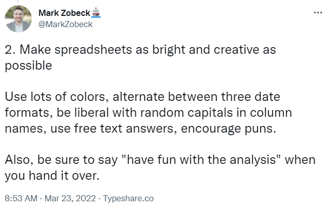

# 432 Class 26: 2024-04-23

[Main Website](https://thomaselove.github.io/432-2024/) | [Calendar](https://thomaselove.github.io/432-2024/calendar.html) | [Syllabus](https://thomaselove.github.io/432-syllabus-2024/) | [Notes](https://thomaselove.github.io/432-notes/) | [Contact Us](https://thomaselove.github.io/432-2024/contact.html) | [Canvas](https://canvas.case.edu) | [Data and Code](https://github.com/THOMASELOVE/432-data) | [Sources](https://github.com/THOMASELOVE/432-classes-2024/tree/main/sources)
:-----------: | :--------------: | :----------: | :---------: | :-------------: | :-----------: | :------------: |:------:
for everything | for deadlines | expectations | from Dr. Love | ways to get help | lab submission | for downloads | to read

## Today's Slides

Class | Date | HTML | Word | Quarto .qmd | Recording
:---: | :--------: | :------: | :------: | :------: | :-------------:
26 | 2024-04-23 | **[Slides 26](https://thomaselove.github.io/432-slides-2024/slides26.html)** | *[Word 26](https://thomaselove.github.io/432-slides-2024/slides26w.docx)* | **[Code 26](https://github.com/THOMASELOVE/432-slides-2024/blob/main/slides26.qmd)** | Visit [Canvas](https://canvas.case.edu/), select **Zoom** and **Cloud Recordings**

## Announcements

1. We will provide an answer sketch, grades and feedback on Quiz 2 in class on Thursday 2024-04-25.
2. 

## Today's Topics

What we saw back in Class 19...

- [Source (Mark Zobeck's twitter thread)](https://twitter.com/MarkZobeck/status/1506615109170442244)
- The two references in the final image are dead links. Instead, use these:
    - [Statistical Problems to Document and To Avoid](https://discourse.datamethods.org/t/author-checklist/3407)
    - [Glossary of Statistical Terms (from Frank Harrell)](https://hbiostat.org/glossary/)

In addition to these materials, the main topics today come from:

- [A CHecklist for statistical Assessment of Medical Papers (the CHAMP statement): explanation and elaboration](https://bjsm.bmj.com/content/55/18/1009.2)
- [Biostatistical Modeling Plan](https://www.fharrell.com/post/modplan) from Frank Harrell.

